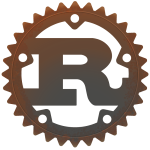

<!DOCTYPE html>
<html lang="en">
    <head>
        <meta charset="UTF-8" />
        <meta http-equiv="X-UA-Compatible" content="IE=edge" />
        <meta name="viewport" content="width=device-width, initial-scale=1.0" />
        <link rel="stylesheet" href="style.css" />
        <title>Document</title>
    </head>
    <body>
        

            <h1>&#x1F30E Olá Mundo, eu sou Michel Ângelo</h1>
            <h2>Estudante de Eletrônica e Programação Web, Funcional && POO</h2>
            
        

        
&#x2764 Atualmente estudando tecnologias web &#x2764

        

            
            
            
            
            
        

        

            
             
            
        

    </body>
</html>
